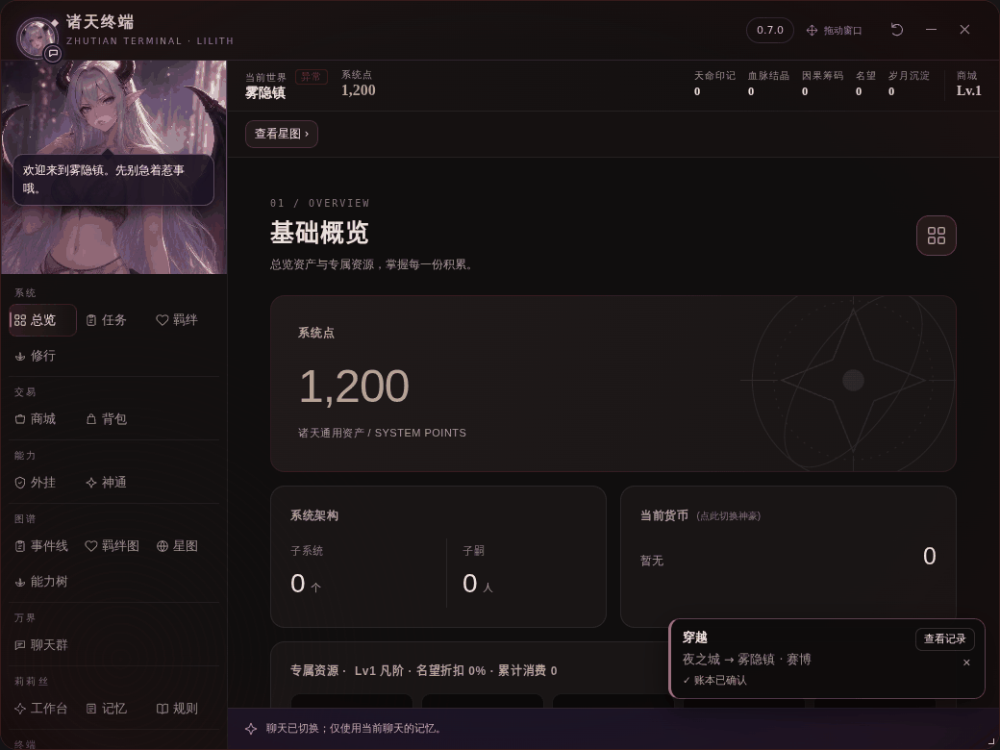
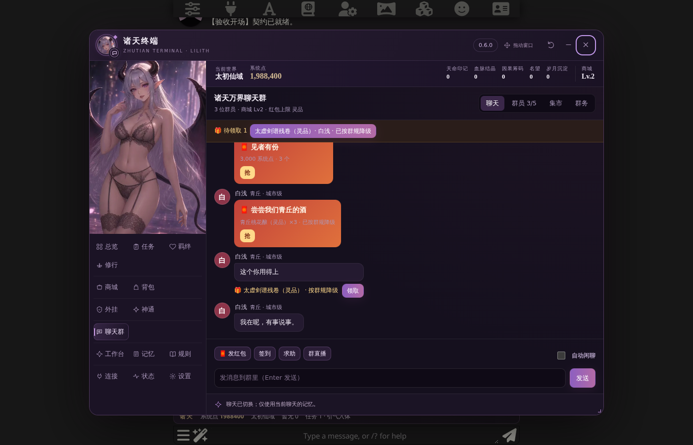

# 更新记录（CHANGELOG）

每个版本的完整说明在 `docs/CHANGES-<版本>.md`，验收记录在 `docs/ACCEPTANCE-<版本>.md`。本文件按版本倒序汇总，1.0.0 以前的内容是从旧 README 原样移来的。

## 1.1.1

bug 修复小版本：神品 1000 抽保底（世界书规则版本 1.1.1）；群红包宽松识别、未入账标注、旧消息补登；数据块格式守卫（新回复自动整理且可还原、旧楼层显示和提示词按整理后的块、每轮格式提醒、「激活 / 领悟《X》」改写为 收录:X、剧情功法未入账提示、缺失时补记·实验性）；页面整体上移修复；手机全屏时终端左上角的莉莉丝头像不再压进状态栏（触屏浮窗也避开状态栏 / 刘海）；盲盒和商店截断时保留完整结果并减半批次，盲盒每 10 抽结算。

**发布前审查修复**：保留 / 分解 / 品阶分解 / 全部保留 / 回收 改为一次加锁写入（不再吞奖励或重复奖励）；补记期间账本有变化就不写、固定到发起的聊天、插件停用后不写；「还原原文」保存完整原文并拒绝不完整备份；背包只叠加名称 / 品级 / 价格 / 来源 / 分类 / 效果都相同的物品；swipe / 重新生成前先回滚本楼快照，非系统点资产不再叠加；抽卡保存未确认时如实提示。

见 [CHANGES-1.1.1](docs/CHANGES-1.1.1.md)、[ACCEPTANCE-1.1.1](docs/ACCEPTANCE-1.1.1.md)。

## 1.1.0

**修订1.1.0-patch4**：修复旧终端在切换聊天后仍能读写新聊天；绑定原聊天身份与上下文，释放页面时撤销接口，排队/异步操作在提交前重查。348项单测、60项静态检查和9项隔离浏览器检查通过；本轮未在真实酒馆实例验收。[本轮台账](docs/PATCH-1.1.0-4.md)。

**修订1.1.0-patch3**：聊天群异步回复固定目标聊天；鉴定保留物品来源批次及回收价格；服务器核验/异步更新器后重查页面账本，冲突拒写不重扣；保存前安全上下文与Web Locks预检，连接协议单列、宿主延迟保存失败记入诊断。330单测和10套301项浏览器回归通过，未真实模型/实体手机验收。[本轮台账](docs/PATCH-1.1.0-3.md)。

触屏浮窗/圆形入口、独立剧情收纳、多目标羁绊、商品定制与去重、API预算与截断诊断、精简操作记录、世界书无强制削弱及备份冲突处理、记忆别名规范化；账本schema2与服务器读回冻结保护。基于main ce29f61增量修改，原始vendor未改。

见 [CHANGES-1.1.0](docs/CHANGES-1.1.0.md)、[ACCEPTANCE-1.1.0](docs/ACCEPTANCE-1.1.0.md)、[替换清单](docs/REPLACE-1.1.0.md)。

## 1.0.0

见 [docs/CHANGES-1.0.0.md](docs/CHANGES-1.0.0.md)、[docs/ACCEPTANCE-1.0.0.md](docs/ACCEPTANCE-1.0.0.md)。

- 手机悬浮莉莉丝改为抠图人物（无卡片），翅膀扇动、表情、眨眼、说话口型；
- 设置页分「常用 / 进阶设置 / 诊断与维护」，可搜索；
- 导出 / 导入存档（不含 API Key，导入先预览、先备份、读回校验）；账本结构版本（旧聊天先备份再升级，新版本写过的账本只读）；
- 账本回滚前总会先备份当前状态；失败提示统一说明「账本有没有改动、下一步做什么」；
- 手机横屏导航只放 6 个常用页 + 「更多」；动态效果在低端机上自动精简；
- `/zt init` 不再顺带打开世界书弹窗；新增 `/zt export`；
- 新增 `LICENSE`（源码可见、保留所有权利，禁止再分发、商用和 AI 训练）、`docs/UNINSTALL.md`；README 精简，历史移到本文件。

玩家反馈补充（版本号不变）：
- 品阶鉴定：剧情 / 角色卡 / 旧存档来的功法和物品不再锁死凡品，可 AI 鉴定或手动修正（只升不降）；「收录:功法名[更高品阶]」可更正；
- 分功能 API：抽卡、聊天群、莉莉丝私聊等 11 处可各用各的接口；接口预设（必须输入名称才能保存）；
- 设置里一键关闭插件；悬浮莉莉丝可拖到底部 / 右键关闭，提示从酒馆「扩展」面板重新进入控制台；
- 修复：切换聊天后注入的提示词可能丢失；手机上聊天页的演出卡片、备用入口按钮和「关闭悬浮窗」目标跑到屏幕上方外面看不见。

## 0.5.0 – 0.8.5 版本摘要（旧 README 顶部）

**0.5.0 起，整个诸天系统都在一个窗口里**：点莉莉丝头像打开「诸天终端」，总览、任务、羁绊、修行、商城、背包、外挂、神通、莉莉丝工作台、记忆、设置全在同一个导航里；聊天楼层不再显示状态栏，只留一个「✧ 系统已记录」小标签。见 [CHANGES-0.5.0](docs/CHANGES-0.5.0.md)。

**0.6.0 新增诸天万界聊天群**：终端里的跨世界 QQ 群，群员能聊天、发红包、送礼、求助、直播、降临到剧情里；群员送来的东西真的写进账本。见 [CHANGES-0.6.0](docs/CHANGES-0.6.0.md)。

**0.7.0 让终端跟着世界走**：仙侠 / 赛博 / 诡异三套世界主题自动切换；莉莉丝会对你选中的任务、物品和结算成败作出反应；新增「图谱」（事件线、羁绊图、星图、能力树），节点全部连回账本记录；穿越、突破、契约、任务完成、抽取、入库都有可跳过的短演出，而且只在账本写入并读回后才播放。见 [CHANGES-0.7.0](docs/CHANGES-0.7.0.md)。

**0.8.0 把莉莉丝和终端合成一体**：莉莉丝页面跟随世界主题，原状态栏的莉莉丝那一行改成立绘气泡（点空白处有剧情台词）；顶栏与基础概览的系统点统一从账本读取；管理员控制台收进设置；导航新增「自拟」外挂；熟练度阶段效果真正告诉 AI，剧情里用过的功法会积累实战；可以从角色卡读取功法。见 [CHANGES-0.8.0](docs/CHANGES-0.8.0.md)。

**0.8.1 修复版**：莉莉丝连接页「拉取模型」不再总报 CORS（被拦截时经你自己的酒馆服务器转发）；聊天群招募真随机、按你的系统点挑实力档、入群费从 300 起；群员红包三四轮一次（你主动要除外）；聊天群里得到的东西带着来历写进剧情提示；世界书可一键更新到插件版（先备份）或导出 JSON。见 [CHANGES-0.8.1](docs/CHANGES-0.8.1.md)。

**0.9.0 手机端适配**：手机上终端全屏（横屏时导航移到左侧），跟着输入法键盘变矮、输入框不再被挡；私聊也全屏；按钮放大、输入框 16 px（iOS 不再放大页面）；悬浮莉莉丝在终端打开时停在下角；手机上用过以后，电脑上的终端窗口大小不再被改掉。设置 →「手机上的终端与私聊窗口」可改回浮动窗口。只在手机模拟里验收，真机未测。见 [CHANGES-0.9.0](docs/CHANGES-0.9.0.md)，距离 1.0 还差什么见 [ROADMAP-1.0](docs/ROADMAP-1.0.md)。

**0.8.5**：修复手机上最新一层不渲染、显示成原始数据（漏掉「生成结束」事件时以停止按钮为准，兼容诊断可查看并重新渲染最新楼层）；AI 接口设置改为「一句话状态 + 三步」，修复单选框排版；记忆页「立即核验最新正文」增加说明，没开启时高亮要勾的开关和保存按钮。见 [CHANGES-0.8.5](docs/CHANGES-0.8.5.md)。

**0.8.4**：所有 API 请求改为流式（修复拉模型报截断、聊天 502、附带剧情的私聊超时），私聊超时可设 60–600 秒（默认 180）；手机上终端里点私聊不再关掉终端；API 设置合并为一处（终端「连接」页）；新增 7 套配色方案，仙侠主题改为墨玉金；神豪挥霍、诸天打手等强力模块可开关（新装世界书默认关闭这两条）；兼容更多楼层美化（iframe 卡片渲染器、JS 美化脚本、正则美化）。见 [CHANGES-0.8.4](docs/CHANGES-0.8.4.md)。

**0.8.3**：悬浮莉莉丝默认缩小到 75%，大小可在设置里调（55%–100%）；修复终端打开时点她会关掉终端的问题（现在点她只说话），以及她出来后又自己缩回边缘的问题。见 [CHANGES-0.8.3](docs/CHANGES-0.8.3.md)。

**0.8.2**：停用插件时自动把诸天世界书从角色卡 / 全局 / 当前聊天上解绑（SillyTavern 1.17+），设置里也有「一键解绑」和「恢复绑定」；手机上左下角按钮换成可拖动的悬浮莉莉丝，拖到边缘会躲起来，立绘看不到时台词在她旁边弹出；修复开启插件后角色卡自带状态栏（酒馆助手前端）不显示的 bug；聊天群物品来历存在背包上、自动闲聊每 N 轮一次、红包与扩群价格平衡。世界书内容未变，无需重新导入。见 [CHANGES-0.8.2](docs/CHANGES-0.8.2.md)。

## 0.9.4

小改进（用户反馈），完整说明见 [CHANGES-0.9.4](docs/CHANGES-0.9.4.md)，验收见 [ACCEPTANCE-0.9.4](docs/ACCEPTANCE-0.9.4.md)。

- **聊天群 → 群员 → 发布招募令**：以前选着「随机世界」时，输入框里填什么都不起作用，招来的还是随机世界的人。现在在输入框里打字会**自动改为「指定世界」**（之后仍可改成「指定角色」）；切回「随机世界」会清空输入框；输入框的提示文字随模式变化。
- 选了「指定世界 / 指定角色」却没填名字时，直接提示“请填写世界名 / 角色名”，**不扣 100 点**。
- 账本、存储键、世界书都没有变化。

## 0.9.3

用户反馈修复 + 新手引导，完整说明见 [CHANGES-0.9.3](docs/CHANGES-0.9.3.md)，验收见 [ACCEPTANCE-0.9.3](docs/ACCEPTANCE-0.9.3.md)。

- **规则 → 额外世界背景可以读取世界书了**：以前点「读取书目」会提示“当前助手缺少世界书读取接口”（酒馆助手版能读，插件版不能）。现在插件自己提供这两个读取接口，SillyTavern 和 TauriTavern 都走同一条路，不需要酒馆助手；只读，不改、不绑定、不解绑任何世界书。
- **星图里识别错的世界可以更正**：选中世界 →「识别错了？更正这个世界」，改世界名或世界类型（例如把被猜成仙侠的「灵笼」改成末世）。更正不算一次穿越、不播放演出；改名撞上已有足迹会自动合并；去过的世界列表里写错的可以「从足迹删除」。按名称猜出来的类型在星图上标「?」；当前世界的节点和顶栏主题保持一致。
- **新手引导**：第一次打开终端、还有步骤没完成时会自动出现一次（之后在 终端 → 引导，或 设置 → 上手 → 新手引导）。三步：导入或更新世界书 → 设置 AI 接口（可一键用酒馆当前的主模型）→ 在当前聊天启用（建账本 + 打开莉莉丝记忆）。每步按真实状态打勾，可以跳过。

## 0.9.2

真机反馈修复，完整说明见 [CHANGES-0.9.2](docs/CHANGES-0.9.2.md)，验收见 [ACCEPTANCE-0.9.2](docs/ACCEPTANCE-0.9.2.md)。

- **莉莉丝台词不再出现两遍**：以前如果别的扩展（例如给词语加虚线下划线的关键词高亮）先改过台词那一段，楼层里会同时出现原文和语音框，现在只显示语音框。
- **状态栏原文不再露出**：以前如果变量类扩展在酒馆画完楼层后又改了消息，`系统点: … / 好感度: …` 这些原始行会留在楼层里，现在只剩「✧ 系统已记录」小标签。
- **语音框不再跑到角色卡状态栏下面**：酒馆助手 / 小白X 渲染的前端卡回到它在消息里的位置；前端卡代码里的 `莉莉丝：…` 也保持原样，不会被改坏。
- iframe 前端卡、角色卡状态栏、插件处理之后才执行的美化，都和以前一样保留。
- 已在隔离酒馆里按手机上的情况复现并修好，**还需要在你的手机上复测**。

## 0.9.1

完整变更见 [CHANGES-0.9.1](docs/CHANGES-0.9.1.md)，验收结果见 [ACCEPTANCE-0.9.1](docs/ACCEPTANCE-0.9.1.md)。

- **手机真机自检**：设置 → 兼容与维护 →「手机真机自检…」（或 `/zt selftest`）。
  - 屏幕顶部的小卡片带着走 8 步，大约 2 分钟：全屏、逐页测量、聊天群 + 键盘、私聊、悬浮莉莉丝、横屏、返回键。
  - 需要你做的只有：点一下输入框、把手机横过来再转回去、按一次返回键。
  - 结束后「复制结果」一键复制，发给开发者即可。自检不写账本、不发消息、不调用模型。
- **复制诊断信息**：设置 → 兼容与维护（或 兼容诊断 弹窗、`/zt copydiag`）。
  - 一段纯文本：版本、设备、宿主接口、运行状态、AI 接口的主机名和模型名、插件设置、上次自检、最近 30 条插件报错。
  - **不含 API Key、聊天内容和账本数值**；报错里夹带的密钥也会被遮住。
  - 手机用局域网地址打开酒馆（没有 HTTPS）时也能复制。
- **手机修正**：弹出键盘时把整个页面变矮的 WebView / 套壳浏览器，现在也能识别为键盘弹出，输入框不再被挡。
- **工程化**：全部文件统一 LF 换行并加 `.gitattributes`；GitHub Actions 自动检查；`npm run filelist` 生成 `FILELIST.sha256`；版本号断言集中到 `tests/version.test.js`。
  - 这次换行符统一会让 25 个文件在 GitHub 上显示为整文件改动，只此一次。
- 真机：**还没有真实手机的结果**，等 Android 手机上跑完自检再补进验收。iPhone 未测。

## 0.9.0

完整变更见 [CHANGES-0.9.0](docs/CHANGES-0.9.0.md)，验收结果见 [ACCEPTANCE-0.9.0](docs/ACCEPTANCE-0.9.0.md)，1.0 之前还要做的事见 [ROADMAP-1.0](docs/ROADMAP-1.0.md)。

- **终端全屏**：
  - 手机上终端铺满屏幕，留出刘海和底部手势条的位置；
  - 横屏时导航改为左侧竖栏，844×390 下内容区从 122 px 增加到 250 px；
  - 横屏用过以后回到竖屏，不会再沿用横屏时的小窗口。
- **输入法键盘**：键盘弹出时终端跟着变矮，账本条和状态行暂时让开，聊天群和私聊的输入框始终可见；收起键盘后恢复。
- **私聊**：手机上同样全屏，跟随键盘。
- **好点、不放大**：
  - 按钮、导航、聊天群标签和发送按钮都放大了；
  - 触摸屏上的输入框统一 16 px，iOS 不会再一点输入框就放大整个页面。
- **悬浮莉莉丝**：终端打开时停在下角（横屏停在右侧）；点她的台词即收起，在终端里滚动时台词也会收起。
- **电脑上的窗口大小**：手机上用过终端后，电脑上记住的窗口大小不再被改成手机尺寸。
- **设置**：设置 →「手机上的终端与私聊窗口」，可选 自动（默认）/ 总是全屏 / 浮动窗口（0.8.5 的样子）。
- 只在 Chromium 手机模拟（390×844、844×390、360×640，触摸事件）里验收，**真实 iPhone / Android 未测**。

## 0.8.5

完整变更见 [CHANGES-0.8.5](docs/CHANGES-0.8.5.md)，验收结果见 [ACCEPTANCE-0.8.5](docs/ACCEPTANCE-0.8.5.md)。

- **手机楼层不渲染**：手机切后台等情况下酒馆可能漏发「生成结束」事件，插件一直以为还在生成，于是跳过最新一层。现在以酒馆停止按钮为准，最新一层照常渲染。设置 → 兼容诊断新增「最新楼层」状态和「重新渲染楼层」按钮。
- **AI 接口设置**（终端「连接」页）：一句话说明当前状态，按「选择用哪个 AI → 填写接口 → 测试并保存」三步操作；「保存到…」收进「高级设置」；单选框恢复正常大小。
- **账本核验**（终端 →「记忆」页）：「立即核验最新正文」= 不请求模型，用最新正文末尾的诸天数据对照账本并结算奖励。使用前先勾选「在当前聊天启用助手与记忆注入」和「莉莉丝监管账本与奖励」，再点「保存当前聊天设置」。没开启时，现在会高亮这几处并用白话提示。

## 0.8.4

完整变更见 [CHANGES-0.8.4](docs/CHANGES-0.8.4.md)，验收结果见 [ACCEPTANCE-0.8.4](docs/ACCEPTANCE-0.8.4.md)。

- **API**：
  - 对话请求一律流式传输，直连和经酒馆服务器转发都是，长回复不再被代理掐断（502 / 超时）；
  - 拉模型失败时显示可读原因；
  - 超时在 设置 →「独立 API 超时」里选，默认 180 秒。
- **私聊**：手机上从终端点私聊，私聊盖在终端上方打开，终端不再被关掉。
- **一处 API 设置**：终端「连接」页就是 API 中心（0.8.5 起叫「AI 接口设置」），一次保存同时写入状态栏和莉莉丝。
- **配色方案**：设置 →「配色方案」，7 套固定配色可选，也可以跟随世界主题；仙侠默认改为墨玉金。
- **强力模块**：外挂管理 →「强力模块」，开关会写进世界书。新安装的世界书默认关闭神豪挥霍、诸天打手；已有的世界书不会被自动修改，外挂管理里有「一键平衡」按钮。
- **美化兼容**：别的扩展渲染的卡片 / iframe、JS 美化脚本改过的段落、正则美化，插件重建楼层时都会保留，不会重复显示。

## 0.8.3

完整变更见 [CHANGES-0.8.3](docs/CHANGES-0.8.3.md)，验收结果见 [ACCEPTANCE-0.8.3](docs/ACCEPTANCE-0.8.3.md)。

- **悬浮莉莉丝大小**：设置 → 莉莉丝 →「悬浮莉莉丝大小」，有特小 55%、小 65%、标准 75%（默认）、大 90%、特大 100%（0.8.2 的大小）五档。
- **终端开着时点她**：以前会触发「点击终端外部时关闭」，现在点她只会说一句话，终端保持打开。真正点在终端外面照样会关闭。
- **她出来后又自己缩回边缘**：以前关掉终端、旋转屏幕或刷新后会发生，现已修复。只有拖动后松手在边缘时才会躲起来。

## 0.8.2

完整变更见 [CHANGES-0.8.2](docs/CHANGES-0.8.2.md)，验收结果见 [ACCEPTANCE-0.8.2](docs/ACCEPTANCE-0.8.2.md)。

- **解绑世界书**：
  - 设置 → 世界书 →「一键解绑世界书」：从角色卡（主世界书和附加世界书）、全局世界书、当前聊天上取下诸天世界书，世界书本身不删除；
  - 解绑后可「恢复绑定」；
  - 在扩展列表里停用插件时会自动解绑（默认开启，**需要 SillyTavern 1.17+**；1.16 没有停用钩子，请手动点）。
- **悬浮莉莉丝**（手机 / 触屏默认开启）：
  - 点一下打开终端，双击戳她；
  - 长按拖动，拖到左右边缘会播放躲藏动画并藏在那里；
  - 位置会记住；
  - 立绘看不到时，她的反应和系统播报在她旁边的气泡里弹出。
- **角色卡自带状态栏**：插件重建楼层时会把酒馆助手挂好的状态栏 iframe 一起删掉，酒馆助手不会再挂第二次，所以状态栏不显示，或者要等下次重渲染才出现。现在原地保留（1.19 + 酒馆助手实测：0/12 → 12/12）。
- **聊天群**：
  - 物品来历写在背包物品上，剧情提示从背包读取；
  - 自动闲聊每 N 次正文回复一次（默认 3）；
  - 群员点数红包不超过其入群费；
  - 扩建费改为容量 × 1,000。

## 0.8.1 修复

完整变更见 [CHANGES-0.8.1](docs/CHANGES-0.8.1.md)，验收结果见 [ACCEPTANCE-0.8.1](docs/ACCEPTANCE-0.8.1.md)。

- **莉莉丝独立 API**：原版连接页拉取模型时调用的 `fetch` 在插件的私有作用域里不存在，0.4 起每次都显示「CORS」；现已修复。浏览器真被 CORS 拦下时，经你自己的酒馆服务器转发，保留 `/v1` 基础路径。只填域名时不再拼出 `//models` 这样的双斜杠地址。
- **聊天群招募**：
  - 刚出现过的候选人不会再出现；
  - 随机模式在本地抽世界类型和目标实力档，并按你的系统点限制实力档；
  - 入群费改为 300 / 1,500 / 6,000 / 3 万 / 20 万 / 200 万 / 3,000 万 / 5 亿；招募令 100 点；
  - 买不起的候选人不会扣成负数。
- **群员红包节奏**：账本强制三到四轮一次，模型硬发的不入账；你在群里主动要（红包 / 送礼 / 礼物…）时本轮允许。
- **正文衔接**：新字段 `聊天群.入库记录` 记录群里真正入账的东西。剧情提示会写明这些东西来自聊天群，要求 AI 不得改写来历、不编造群聊。
- **世界书插件版**：在原版 35 条上修正过时说明（管理员入口、酒馆助手），新增「36｜联动｜诸天聊天群」。设置里可「更新到最新版（先备份）」或「导出 JSON」，旧书不会被自动覆盖。

## 0.8.0 新增

完整变更见 [CHANGES-0.8.0](docs/CHANGES-0.8.0.md)，验收结果见 [ACCEPTANCE-0.8.0](docs/ACCEPTANCE-0.8.0.md)。

- **界面统一**：莉莉丝工作台、记忆、规则等原版页面使用当前世界主题的底色和边框（仙侠玉简 / 赛博全息 / 诡异），底部状态行使用主题栏色；默认主题保持原版紫色。
- **莉莉丝气泡**：原状态栏里「宿主大人，莉莉丝已上线~」那一行不再显示，数据块里的「系统播报」改在立绘气泡里说；点立绘空白处出现剧情式台词（取自账本：任务、世界、系统点等）。手机上立绘收起时改用提示条。
- **系统点一致（修复）**：基础概览原先按楼层面板文本填数，签到等楼层外写入后与顶栏不一致；现在引擎显示的数值与顶栏一样从账本读取。
- **管理员控制台**：设置 → 高级 · 管理员 → 管理员控制台；终端里不再露出入口。
- **自拟外挂**：导航「能力」组新增「自拟」，外挂页新增「＋ 自拟外挂」；发动扣费会盖 `界面记账时间`，不会被下一条数据块退回（修复）。
- **熟练度有实际作用**：各功法当前阶段的效果（熟练 −30% 消耗、精通 +100% 威力、宗师专属奥义、入道无消耗瞬发；未入门不可靠）作为提示词告诉 AI；剧情里用过但「功法修炼」漏写的功法自动 +2 实战积累（受品阶上限约束，同一楼层只算一次）；阶段提升会让 AI 在下一条回复里播报。
- **读取角色卡功法**：从当前角色卡变量 / 聊天变量里常见的功法结构导入到功法库，只增不减，不修改角色卡本身；记录在 `角色卡功法同步` 与 `功法记录`。
- **其他修复**：管理员 / 抽卡 / 详情对话框打开时引擎可能被重载；楼层外写入后引擎系统点陈旧；过时的「连点 ◆ 五次」提示。

## 0.7.0 新增

完整变更见 [CHANGES-0.7.0](docs/CHANGES-0.7.0.md)，验收结果见 [ACCEPTANCE-0.7.0](docs/ACCEPTANCE-0.7.0.md)。

- **世界主题**：按 `世界类型` / `当前世界` / 货币自动判断仙侠（玉简、星图、阵纹）、赛博（全息终端）、诡异（克制的异常与侵蚀）；也可以在设置里固定。只换颜色和装饰，按钮位置不变；「减少动态效果」时静止。到过的世界记在新字段 `诸天系统.万界足迹`。
- **莉莉丝界面角色**：选中任务 / 物品 / 功法、结算成功或失败时，用原版表情和分层动作反应，台词带账本数据；系统页半身、工作台全身、私聊面部特写、剧情提示胸像。不新增动作，不伪装 Live2D。
- **图谱**：导航新增「图谱」组——事件线（起因 → 任务 → 结算）、羁绊图、星图、能力树。每个节点显示原始账本字段和路径，可跳回任务页原行、聊天群、外挂或聊天楼层。
- **演出**：穿越、突破、契约、任务完成 / 失败、抽取、奖励入库。只在账本保存并读回后播放，播放前再核对一次，被回滚的标为「未入账」；≤2.1 秒，点击 / Esc 可跳过，结束后一定留下结果卡片。可改为只显示卡片或关闭。
- **楼层内状态栏（旧兼容模式）不再提供**：旧存档升级时自动迁到终端模式一次；代码保留供回归测试。

## 0.6.0 新增

完整变更见 [CHANGES-0.6.0](docs/CHANGES-0.6.0.md)，验收结果见 [ACCEPTANCE-0.6.0](docs/ACCEPTANCE-0.6.0.md)。

- **聊天群**：终端导航「万界 · 聊天群」，分聊天、群员、集市、群务四页。数据存在 `诸天系统.聊天群`，跟随存档。
- **招募与群员**：发布招募令（随机或指定世界），按实力档付入群费；可扩建、私聊、禁言、踢人、设管理员。
- **红包 / 赠礼 / 集市**：群员发的系统点和物品，抢到、领取、买下时**先写入账本并读回确认，再提示「已入库」**，物品来源记为「名称@世界」。宿主也能发红包、挂单出售。
- **规则底线**：群员送出的物品品阶不超过商城等级和群员自身实力，禁忌品禁止，超标自动降级；系统点红包和每日红包个数有上限。群规本身可以改。
- **和剧情联动**：求助会生成原版任务（待接取）；降临让群员在接下来 3 轮剧情里登场；群聊摘要可注入剧情；可开启每轮剧情后自动闲聊。

## 0.5.0 新增

完整变更见 [CHANGES-0.5.0](docs/CHANGES-0.5.0.md)，验收结果见 [ACCEPTANCE-0.5.0](docs/ACCEPTANCE-0.5.0.md)。

- **一个窗口**：莉莉丝窗口就是诸天终端，旧的第二个终端窗口已删除。关闭按钮、Esc、点外部、手机返回手势都会一次关掉整个窗口；再打开回到上次的页面。
- **楼层里不再有状态栏**：数据块由终端里的原版引擎记账，楼层只留可关闭的小标签。（0.7.0 起设置里不再提供旧兼容模式，见上文。）
- **原版 8 个分页在终端里**：原版引擎本身在跑，由终端导航切换；写入输入框的操作会提示并提供「关闭终端去发送」。
- **外挂管理 + 自拟外挂**：原版 6 个外挂按聊天开关（关掉的同时告诉 AI 不得使用）；自拟外挂可导出导入，写进提示词，发动时先扣代价并读回确认。
- **所有设置都在终端「设置」页**，扩展设置抽屉只留入口和紧急恢复。
- **立绘**：删除了换服装的 AI 姿势；桌面端立绘保持原比例，手机端系统页面把高度让给内容。

## 0.4.0 新增

完整变更见 [CHANGES-0.4.0](docs/CHANGES-0.4.0.md)，验收结果见 [ACCEPTANCE-0.4.0](docs/ACCEPTANCE-0.4.0.md)。

- **取代 v1.1 全部安装内容**：世界书（自动安装和绑定，附预算检查）、4 个正则、酒馆助手脚本和变量宏。
- **状态栏全部 AI 功能**：AI 进货、许愿、抽卡、背包整理、打手召唤、万物熔炉、实力评估、测试连接。两种接法都可用：
  - 独立 API；
  - 酒馆主 API。
- **API 中心**：配置同时写回原版三处存储，原版界面读到的是同一份。
- **莉莉丝语音美化（可开关）**、**旧楼层精简卡**、**旧楼层面板不发给 AI**（只影响提示词，不改存档）。
- **真实触摸**：抚摸（逐级升温）、长按、点按、触觉反馈；支持移动端。
- **一键接管和恢复旧版**，诊断面板提供 v1.1 替代对照表。
- **新 AI 姿势**：抱臂、侧坐。

## 0.3.0 新增

完整变更见 [CHANGES-0.3.0](docs/CHANGES-0.3.0.md)，验收结果见 [ACCEPTANCE-0.3.0](docs/ACCEPTANCE-0.3.0.md)。

- **1.16–1.19 兼容**：1.17 起用扩展钩子，1.16 自动自启动；接口按能力探测，缺哪个接口就只停用对应功能。
- **原版状态栏原生运行**：8 个分页（基础、羁绊、任务、万象、商城、背包、外挂、神通）都在消息内运行，数据写回原位置。
- **原版莉莉丝助手原生运行**：工作台、记忆档案、规则藏书、连接设置、运行状态、私聊、剧情语音框。
- **外挂世界书**一键安装并绑定到当前聊天（35 条内置规则，已存在时不覆盖，不依赖角色卡 MVU）；新聊天初始化 `/zt init`；旧存档迁移报告；账本备份和回滚。
- **真 Live2D**：加载任意 Cubism 3/4/5 模型，支持表情映射、Tap 动作、HitArea 点触气泡、口型同步和视线跟随。Cubism Core 不打包，同意许可后才加载，见 [vendor/live2d/LICENSES.md](vendor/live2d/LICENSES.md)。
- **莉莉丝分层 PSD 导出**：可以直接在 Cubism Editor 里绑定，做成莉莉丝本人的 Live2D 模型。
- **AI 差分立绘**：8 种表情（只替换脸部，身体和背景像素不变），外加“比心”姿势（静止背景）。来源见 [PROVENANCE](assets/lilith/variants/PROVENANCE.md)。
- **HUD、快捷键 Alt+Z/X/S、`/zt` 命令、`{{zt_points}}`、`{{zt_world}}`、`{{zt_task}}` 宏、兼容诊断面板、扩展设置抽屉。**

## 0.2.0 新增

### 万界交易

- 从原始 `statusbar-v3.1-part2.js` 提取 **52 个原函数**，保留原面板、任务、功法/资源派生及估值规则。
- 最新角色回复中的 `ZhuTianPanel`：**预览 → 明确确认 → 结算**，不自动扫描旧历史发奖。
- 任务实物奖励沿用原助手的**事前承诺、正文证据、品级/数量与稳定凭据校验**。奖励消耗后不会再补发。
- 已有商城库存购买：沿用名望折扣、向上取整、单件入包和售出标记。
- 背包单件使用、单件回收：消耗品扣一件，非消耗品保留；回收采用原估值规则。
- **系统结算记录直接保存在正常聊天正文**，清晰区分于玩家行动和模型回复。

### 写入与失败处理

预览绑定整个聊天与元数据快照；同源标签使用 Web Locks；提交前核对服务器存档，保存时捕获固定角色/聊天目标，不在 await 后重新推断目标。

一次保存同时包含账本、操作凭据和系统消息，随后读取服务器记录核对。网络状态不明时冻结交易、不自动重试、不偷偷退款；请停止操作该聊天，重载并人工核对。

**这不是跨所有客户端的服务端 CAS 事务。** 同源 Web Locks 不锁住其他浏览器、设备或不合作的扩展。请勿并发操作同一个聊天。

正文被编辑、删除或切换分支后，与既有结算来源不一致时会冻结交易，不擅自回滚已花费余额。需要在备份副本上人工核对。

## 已保留的 0.1 能力

- 原版莉莉丝立绘、表情、分层参数动画、注视与点触（默认的 `rig` 模式）。真 Live2D 是另一种模式，需要用户自己提供 `.model3.json` 模型。
- 原生常驻入口（莉莉丝头像）。0.1–0.4 的独立全屏终端和七个视图已在 0.5.0 并入诸天终端。
- 发送保护（附件阻断、过期预览、生成锁、重复发送、读回失败不重发）仍在宿主适配层，由 `native_guards.py` 验收。
- 读取原任务、背包、角色名、35 条内置规则以及原记忆有效分支。
- 明确启用后使用原版回忆算法；不开启自动付费整理。
- WebGL 不可用回退原图，关闭终端和减少动态效果偏好可暂停动画。
