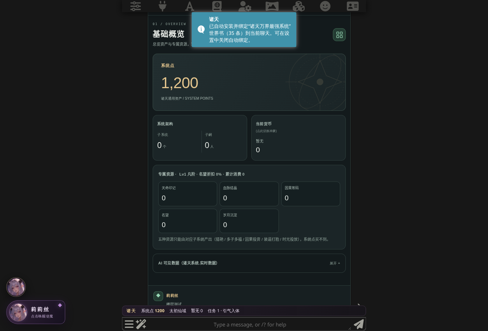

# 诸天 · 莉莉丝契约终端

**0.4.0 原生 SillyTavern 扩展｜支持 SillyTavern 1.16–1.19｜只装本插件即可取代「诸天万界最强系统」v1.1 的全部安装内容**

v1.1 需要装世界书、4 个正则脚本和 1 个酒馆助手脚本；现在这些全部由本插件原生完成，**不需要酒馆助手，也不需要正则脚本**：
- 状态栏 8 个分页及其全部 AI 功能；
- 莉莉丝助手、私聊、触摸互动；
- 可开关的莉莉丝语音美化；
- 旧楼层精简显示，以及旧楼层面板不发给 AI；
- 变量宏；
- 外挂世界书的自动安装和绑定。

另外还提供真 Live2D、AI 差分立绘，以及 API 中心（可选独立 API 或酒馆主 API）。

> 所有 AI 链路都已在真实 SillyTavern 上配合本地**模拟模型**完整跑通，但**还没有接真实模型验收**。第一次使用真实模型时，请先在备份的聊天上试用。见 [功能矩阵](docs/FEATURE_MATRIX.md)。



*截图使用明确标记的隔离测试聊天和模拟模型，不是真实存档。*

## 从 v1.1 迁移（一键接管）

1. 安装本插件（见下一节），然后刷新页面。
2. 打开诸天聊天。插件会自动安装并绑定外挂世界书；已存在的不覆盖。
3. 在扩展设置里点「**一键接管旧版**」（也可以先点「兼容诊断」或输入 `/zt diag`，查看还有哪些旧版内容仍在启用）：
   - 停用旧的 4 个正则和旧的酒馆助手脚本，只停用、不删除；
   - 写盘后自动刷新页面。
   - 想回到旧版时，点扩展设置里的「恢复旧版」。
4. 在扩展设置里点「**API 中心**」，选一种接法：
   - 独立 OpenAI 兼容接口；
   - 直接用酒馆当前的主 API。

   状态栏的所有 AI 按钮和莉莉丝读的是同一份配置。
5. 如果「兼容诊断」提示“世界书预算不足”，点面板里的「一键调整」。ST 默认只把上下文的 25% 分给世界书；上下文太小时，诸天的常驻规则会被 ST 整体丢弃。

逐项替代关系见 [CHANGES-0.4.0](docs/CHANGES-0.4.0.md)。

## Git 安装

在 SillyTavern 的“扩展 → 安装扩展”中粘贴：

```text
https://github.com/falingzhi1-boop/zhutianxitongchajianban
```

支持并在隔离真实宿主上验证过 **SillyTavern 1.16.0、1.17.0、1.18.0、1.19.0**；低于 1.16 拒绝加载，高于 1.19 按接口能力探测运行。安装后刷新页面，打开单角色聊天，点击左下方原版莉莉丝头像（或按 Alt+Z）。支持 HTTPS 或 localhost 安全上下文；交易写入要求浏览器提供 Web Locks。

- 仓库根目录直接包含 `manifest.json`，没有额外套一层目录。
- 前端运行不需要 `npm install`，也不需要酒馆助手。如果仍然开着旧的状态栏正则或旧的莉莉丝助手脚本，本扩展会自动让位或提示停用，避免重复渲染和重复计费。
- 请勿同时安装旧的 `zhutian-covenant-terminal` 手动副本和这个 Git 仓库副本。
- **“扩展可以安装”不等于“全部原版功能已经迁完”。** Git 安装验收的具体结果以 `docs/INSTALL_ACCEPTANCE.md` 为准。

## 0.4.0 新增

完整变更见 [CHANGES-0.4.0](docs/CHANGES-0.4.0.md)，验收结果见 [ACCEPTANCE-0.4.0](docs/ACCEPTANCE-0.4.0.md)。

- **取代 v1.1 全部安装内容**：世界书（自动安装和绑定，附预算检查）、4 个正则、酒馆助手脚本和变量宏。
- **状态栏全部 AI 功能**：AI 进货、许愿、抽卡、背包整理、打手召唤、万物熔炉、实力评估、测试连接。两种接法都可用：
  - 独立 API；
  - 酒馆主 API。
- **API 中心**：配置同时写回原版三处存储，原版界面读到的是同一份。
- **莉莉丝语音美化（可开关）**、**旧楼层精简卡**、**旧楼层面板不发给 AI**（只影响提示词，不改存档）。
- **真实触摸**：抚摸（逐级升温）、长按、点按、触觉反馈；支持移动端。
- **一键接管和恢复旧版**，诊断面板提供 v1.1 替代对照表。
- **新 AI 姿势**：抱臂、侧坐。

## 0.3.0 新增

完整变更见 [CHANGES-0.3.0](docs/CHANGES-0.3.0.md)，验收结果见 [ACCEPTANCE-0.3.0](docs/ACCEPTANCE-0.3.0.md)。

- **1.16–1.19 兼容**：1.17 起用扩展钩子，1.16 自动自启动；接口按能力探测，缺哪个接口就只停用对应功能。
- **原版状态栏原生运行**：8 个分页（基础、羁绊、任务、万象、商城、背包、外挂、神通）都在消息内运行，数据写回原位置。
- **原版莉莉丝助手原生运行**：工作台、记忆档案、规则藏书、连接设置、运行状态、私聊、剧情语音框。
- **外挂世界书**一键安装并绑定到当前聊天（35 条内置规则，已存在时不覆盖，不依赖角色卡 MVU）；新聊天初始化 `/zt init`；旧存档迁移报告；账本备份和回滚。
- **真 Live2D**：加载任意 Cubism 3/4/5 模型，支持表情映射、Tap 动作、HitArea 点触气泡、口型同步和视线跟随。Cubism Core 不打包，同意许可后才加载，见 [vendor/live2d/LICENSES.md](vendor/live2d/LICENSES.md)。
- **莉莉丝分层 PSD 导出**：可以直接在 Cubism Editor 里绑定，做成莉莉丝本人的 Live2D 模型。
- **AI 差分立绘**：8 种表情（只替换脸部，身体和背景像素不变），外加“比心”姿势（静止背景）。来源见 [PROVENANCE](assets/lilith/variants/PROVENANCE.md)。
- **HUD、快捷键 Alt+Z/X/S、`/zt` 命令、`{{zt_points}}`、`{{zt_world}}`、`{{zt_task}}` 宏、兼容诊断面板、扩展设置抽屉。**

## 0.2.0 新增

### 万界交易

- 从原始 `statusbar-v3.1-part2.js` 提取 **52 个原函数**，保留原面板、任务、功法/资源派生及估值规则。
- 最新角色回复中的 `ZhuTianPanel`：**预览 → 明确确认 → 结算**，不自动扫描旧历史发奖。
- 任务实物奖励沿用原助手的**事前承诺、正文证据、品级/数量与稳定凭据校验**。奖励消耗后不会再补发。
- 已有商城库存购买：沿用名望折扣、向上取整、单件入包和售出标记。
- 背包单件使用、单件回收：消耗品扣一件，非消耗品保留；回收采用原估值规则。
- **系统结算记录直接保存在正常聊天正文**，清晰区分于玩家行动和模型回复。

### 写入与失败处理

预览绑定整个聊天与元数据快照；同源标签使用 Web Locks；提交前核对服务器存档，保存时捕获固定角色/聊天目标，不在 await 后重新推断目标。

一次保存同时包含账本、操作凭据和系统消息，随后读取服务器记录核对。网络状态不明时冻结交易、不自动重试、不偷偷退款；请停止操作该聊天，重载并人工核对。

**这不是跨所有客户端的服务端 CAS 事务。** 同源 Web Locks 不锁住其他浏览器、设备或不合作的扩展。请勿并发操作同一个聊天。

正文被编辑、删除或切换分支后，与既有结算来源不一致时会冻结交易，不擅自回滚已花费余额。需要在备份副本上人工核对。

## 已保留的 0.1 能力

- 原版莉莉丝立绘、表情、分层参数动画、注视与点触（默认的 `rig` 模式）。真 Live2D 是另一种模式，需要用户自己提供 `.model3.json` 模型。
- 原生常驻入口、全屏终端、手机角色面板，现在共七个视图。
- 莉莉丝及其他角色的**玩家行动**进入真实主聊天；逐字预览、勾选确认、保存回读，不覆盖主输入框草稿。
- 读取原任务、背包、角色名、35 条内置规则以及原记忆有效分支。
- 明确启用后使用原版回忆算法；不开启自动付费整理。
- WebGL 不可用回退原图，关闭终端和减少动态效果偏好可暂停动画。

## 尚未完成

- **真实模型验收**：所有 AI 链路只用本地模拟模型跑通过。不会用预设对白冒充 AI 回答。
- **莉莉丝本人的 Live2D 模型**：需要用导出的 PSD 在 Cubism Editor 里人工绑定。
- **未逐项点击**：状态栏里不调用模型的本地动作（外挂和神通的支付类按钮），以及十连和自定义次数抽卡。
- **群聊**：不支持。

见 [功能矩阵](docs/FEATURE_MATRIX.md)、[验收报告](docs/ACCEPTANCE-0.4.0.md)、[接口固定点](docs/API_PINS.md)。

## 数据位置

| 数据 | 位置 |
|---|---|
| 原账本 | `chatMetadata.variables.诸天系统` |
| 原记忆 | `chatMetadata.variables.诸天记忆助手_v1` |
| 本扩展开关与原生凭据 | `chatMetadata.zhutianCovenantTerminal` |
| 正文玩家互动 / 系统凭据标记 | `message.extra.zhutianCovenantTerminal` |
| 回忆提示命名空间 | `zhutian-covenant-terminal/memory` |
| 状态栏 API 配置（原版位置） | 全局变量 `诸天系统_API`，回落 `localStorage.sys_api_config` |
| 莉莉丝 API 配置（原版位置） | 脚本变量 `诸天记忆助手_v1_API` |
| 一键接管记录 | 扩展设置 `takeoverLog`（恢复旧版只处理这里记录的项） |

已发送的消息和已执行交易不会在停用时删除或自动回滚。停用清理的是入口、UI 装饰、事件、动画及本扩展提示。退回 0.1 或旧状态栏不能自动撤销 0.2 已写入的真实账本，请使用事先备份。

## 手动安装与开发

手动放置时，目录为 `public/scripts/extensions/third-party/zhutianxitongchajianban/`，其中直接包含 `manifest.json`。ZIP 是源码/目录安装包，不是声称酒馆支持上传 ZIP 安装。

```bash
npm ci                    # 仅开发与提取工具需要；前端运行不需要
npm run check
npm test
npm run extract:ledger    # 从保留的原五文件中重建两个原版内核
python tools/extract_original.py
```

浏览器验收需要 Python Playwright、Chromium，以及**一次性的**隔离 SillyTavern。`tests/qa/` 里有可复现的全套环境：

```bash
git clone --depth 1 --branch 1.19.0 https://github.com/SillyTavern/SillyTavern /var/tmp/st-1.19.0
(cd /var/tmp/st-1.19.0 && npm i --omit=dev)
python3 tests/qa/setup_isolated_st.py /var/tmp/st-1.19.0 8019    # 配置 config.yaml，并把本仓库链接进 third-party
python3 tests/qa/mock_model.py &                                  # 本地模拟模型 :5001，不需要任何密钥
tests/qa/run_matrix.sh <旧版离线包-v1.1 目录> 1.19.0              # 依次启动每个宿主，跑全部浏览器验收
```

**下列脚本会创建或重置“隔离验收”“结算 QA”“诸天验收”测试聊天，禁止指向生产酒馆；按顺序运行，不要并行。**

```bash
python tests/native_replace040.py --isolated-test-only --base-url http://127.0.0.1:8019 --legacy-dir <旧版离线包-v1.1>
python tests/native_acceptance.py --isolated-test-only --base-url http://127.0.0.1:8019
python tests/native_guards.py --isolated-test-only --base-url http://127.0.0.1:8019
python tests/native_views.py --isolated-test-only --base-url http://127.0.0.1:8019
python tests/native_ledger.py --isolated-test-only --base-url http://127.0.0.1:8019
python tests/native_ledger_guards.py --isolated-test-only --base-url http://127.0.0.1:8019
```

`--legacy-dir` 指向原版 v1.1 离线包，一键接管测试需要读取里面的旧正则。离线包不在本仓库里。

## 来源与交付原则

原版来源：用户指定的 [zhutian-system-v1.1/main/remote](https://github.com/falingzhi1-boop/zhutian-system-v1.1/tree/main/remote)，本轮再核对仍为 `3ee2db2e1388f9843335962c370888f746228d94`。

五个原文件完整同名保留于 `vendor/original/`，不执行旧宿主适配器。提取范围和哈希见两个 provenance JSON。原源码与素材权利归原权利人；星海背景来自前一轮 AI 概念美术，莉莉丝使用原版资源。

**原项目的两个本地导入 JSON 和 v1.1 离线包都不在本仓库，也不会上传。** 本轮未修改旧状态栏匹配规则或正则 HTML。宿主本体、隔离配置、账号数据、依赖目录和连接凭据均不随扩展交付。
