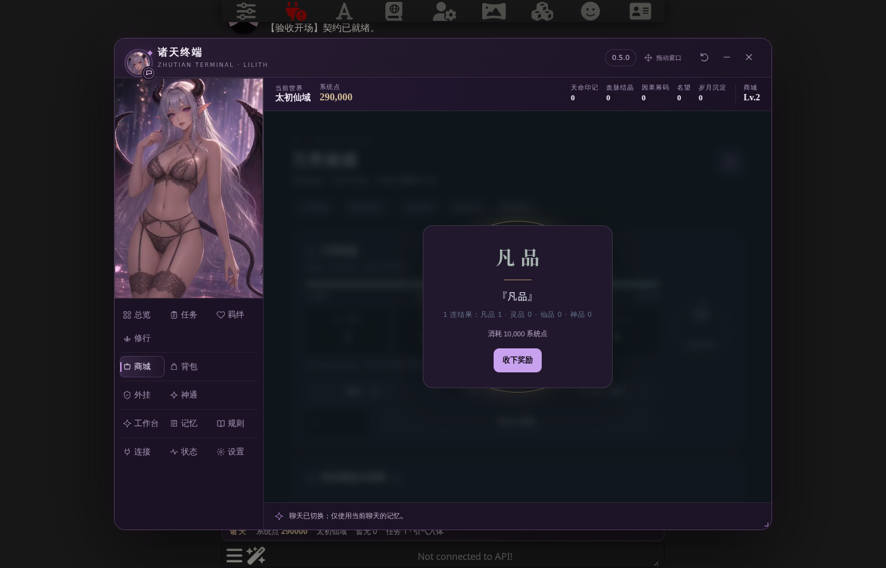

# 诸天终端 · 莉莉丝

**1.0.0 原生 SillyTavern 扩展｜支持 SillyTavern 1.16–1.19｜只装本插件即可取代「诸天万界最强系统」v1.1 的全部安装内容**

点莉莉丝头像（手机上是悬浮的莉莉丝，电脑上按 Alt+Z）打开「诸天终端」：总览、任务、羁绊、修行、商城、背包、外挂、神通、聊天群、图谱、莉莉丝工作台、记忆和设置都在同一个窗口里。聊天楼层不再显示状态栏，只留一个「✧ 系统已记录」小标签。

> **AI 功能是「实验性」的**：所有 AI 链路都在真实 SillyTavern 上配合本地**模拟模型**完整跑通，但**没有用真实模型验收**。第一次用真实模型时，请先在备份的聊天上试用（设置 → 导出 / 导入存档）。逐项状态见 [功能矩阵](docs/FEATURE_MATRIX.md)。



*截图使用明确标记的隔离测试聊天和模拟模型，不是真实存档。*

## 1.0.0

- **悬浮莉莉丝**：手机上不再是一张小卡片，而是从原版立绘里抠出来的莉莉丝本人——翅膀轻轻扇动、会眨眼、说话时动嘴，戳她会换表情；拖动、躲到边缘、点开终端的操作不变。
- **设置更好找**：分「常用 / 进阶设置 / 诊断与维护」三组，顶部可以搜索（例如「悬浮」「超时」）。
- **导出 / 导入存档**：设置 → 账本与存档。一个 .json 文件带走插件设置和当前聊天的诸天账本（可选记忆和私聊记录），**不含 API Key**；导入先显示“现在 → 导入后”，先自动备份，再写入并读回核对。
- **数据更安全**：账本回滚前总会先备份当前状态；账本带结构版本，打开旧聊天时先备份再升级，较新插件写过的账本在旧插件里只读。
- **出错时说清楚**：失败提示统一为「发生了什么。账本：有没有改动。下一步：怎么做」。
- **手机**：横屏左侧导航只放 6 个常用页 + 「更多」；低端机（帧率明显不足）或系统要求减少动态效果时自动精简动画，可在 设置 → 进阶设置 → 动态效果 里改。
- **许可**：新增 [LICENSE](LICENSE)——源码可见、保留所有权利（见下文「许可」）。
- **品阶鉴定**（玩家反馈）：剧情里得到、角色卡或旧存档带来的功法 / 物品被记成凡品时，可在「品阶鉴定」页让 AI 按诸天标准重新鉴定或手动修正（只升不降、最高神品，系统给的不受影响）；数据块再写「收录:功法名[更高品阶]」也能更正。
- **分功能 API + 接口预设**（玩家反馈）：连接页里抽卡、聊天群、莉莉丝私聊等 11 处可以各用各的接口；常用接口存成预设一键切换（必须输入名称才能保存）。
- **一键关闭插件**：设置 → 插件开关。**关闭悬浮莉莉丝**：把她拖到底部「关闭悬浮窗」（电脑可右键），之后从酒馆「扩展」面板 → 诸天终端 → 打开诸天终端 进入控制台。

完整说明见 [CHANGES-1.0.0](docs/CHANGES-1.0.0.md)、验收见 [ACCEPTANCE-1.0.0](docs/ACCEPTANCE-1.0.0.md)，以前的版本见 [CHANGELOG](CHANGELOG.md)。

## 它替代了什么

v1.1 需要装世界书、4 个正则脚本和 1 个酒馆助手脚本；现在全部由本插件原生完成，**不需要酒馆助手，也不需要正则脚本**：

- 原版状态栏 8 个分页及其全部 AI 功能（现在在终端里）；
- 莉莉丝助手、私聊、触摸互动和可开关的语音美化；
- 旧楼层面板不发给 AI；变量宏；外挂世界书的自动安装和绑定。

另外还有：诸天万界聊天群、图谱（事件线 / 羁绊图 / 星图 / 能力树）、仙侠 / 赛博 / 诡异世界主题、可跳过的短演出、真 Live2D 与 AI 差分立绘、API 中心（独立接口或酒馆主 API）、手机全屏布局、新手引导。

## 安装

在 SillyTavern 的「扩展 → 安装扩展」中粘贴：

```text
https://github.com/falingzhi1-boop/zhutianxitongchajianban
```

- 在隔离的真实宿主上验证过 **SillyTavern 1.16.0、1.17.0、1.18.0、1.19.0**；低于 1.16 拒绝加载，高于 1.19 按接口能力探测运行。**1.17.0 以前的酒馆有已公开的安全问题，建议升级到 1.17 或更高。**
- 安装后刷新页面，打开单角色聊天。需要 HTTPS 或 localhost 安全上下文；账本写入要求浏览器支持 Web Locks。
- 前端运行不需要 `npm install`，也不需要酒馆助手。请勿同时安装旧的 `zhutian-covenant-terminal` 手动副本和这个 Git 仓库副本。

**更新**：「扩展 → 管理扩展」里找到「诸天 · 莉莉丝契约终端」，点更新按钮，完成后刷新网页（只刷新网页不会下载新代码）。

**卸载**：见 [docs/UNINSTALL.md](docs/UNINSTALL.md)（先导出存档、解绑世界书，再删除扩展）。

## 从 v1.1 迁移（一键接管）

1. 安装本插件并刷新页面，打开诸天聊天。插件会自动安装并绑定外挂世界书；已存在的不覆盖。
2. 终端 → 设置 →「**一键接管旧版**」：停用旧的 4 个正则和旧的酒馆助手脚本（只停用、不删除），写盘后自动刷新。想回到旧版时点「恢复旧版」；终端打不开时，扩展设置抽屉里还有「紧急恢复旧版」。
3. 终端 →「连接」页设置 AI 接口：独立 OpenAI 兼容接口，或直接用酒馆当前的主 API。状态栏的 AI 按钮和莉莉丝读同一份配置。
4. 「兼容诊断」提示“世界书预算不足”时，点「一键调整」（ST 默认只给世界书 25% 的上下文）。

逐项替代关系见 [CHANGES-0.4.0](docs/CHANGES-0.4.0.md)。

## 常用命令

| 命令 | 作用 |
|---|---|
| `/zt open [页面]` | 打开终端（`status`、`shop`、`bag` 是常用页的快捷方式） |
| `/zt init` | 初始化 / 补齐当前聊天的诸天账本 |
| `/zt backup` | 旧存档迁移 / 账本回滚 |
| `/zt export` | 导出 / 导入存档 |
| `/zt world` | 世界书安装、绑定、解绑 |
| `/zt diag`、`/zt copydiag` | 兼容诊断、复制诊断信息（密钥自动遮挡） |
| `/zt selftest` | 手机真机自检 |

## 尚未完成 / 未验证

- **真实模型**：所有 AI 功能（商城进货 / 许愿 / 抽取、工作台、自动记忆、私聊、聊天群口吻、AI 自动写入当前世界）只用模拟模型验收，标为「实验性」。不会用预设对白冒充 AI 回答。
- **真机**：手机布局、悬浮莉莉丝、横屏导航、动态效果自动降级只在无头 Chromium 的手机模拟里验收；真实 iOS Safari / Android Chrome 的输入法、安全区、长按和帧率未测。设置里的「手机真机自检」可以在自己手机上检查。
- **TauriTavern 等其他宿主**：未测。
- **未逐项点击**：神通的支付类按钮（复制、状态）、分身派遣、随身洞天、自定义次数抽卡。
- **莉莉丝本人的 Live2D 模型**：需要用导出的 PSD 在 Cubism Editor 里人工绑定。
- **酒馆群聊**：不支持（诸天「聊天群」是终端里的功能，和酒馆群聊无关）。
- 停用插件自动解绑世界书需要 SillyTavern 1.17+ 的停用钩子；复制诊断信息按格式遮挡密钥，格式特殊的短密钥可能识别不到。

## 数据位置

| 数据 | 位置 |
|---|---|
| 诸天账本（含聊天群、世界类型、万界足迹、功法同步） | `chatMetadata.variables.诸天系统` |
| 原记忆 / 莉莉丝私聊 | `chatMetadata.variables.诸天记忆助手_v1`、`…_LILITH_CHAT` |
| 本扩展的聊天级记录：凭据、账本备份（最近 5 份）、账本结构版本 | `chatMetadata.zhutianCovenantTerminal`（`.ledgerBackups`、`.ledgerSchema`） |
| 正文互动 / 系统凭据标记 | `message.extra.zhutianCovenantTerminal` |
| 插件设置（悬浮位置 / 大小、配色、超时、动态效果、世界书解绑记录、一键接管记录） | 扩展设置 `zhutian-covenant-terminal` |
| 状态栏 API 配置 | 全局变量 `诸天系统_API`，回落 `localStorage.sys_api_config` |
| 莉莉丝 API 配置（含密钥，**不会被导出**） | 扩展设置里的脚本变量 `诸天记忆助手_v1_API` |
| 接口预设与分功能 API（含密钥，**不会被导出**） | 全局变量 `诸天系统_API路由` |
| 剧情提示命名空间 | `zhutian-covenant-terminal/{memory,group,world,mastery,plugins,grade}` |
| 世界书备份 | 酒馆世界书 `诸天万界最强系统-备份-时间` |

已发送的消息和已执行的交易不会在停用时删除或自动回滚。

## 开发与验收

手动放置时目录为 `public/scripts/extensions/third-party/zhutianxitongchajianban/`，其中直接包含 `manifest.json`。

```bash
npm ci && npm run check && npm test       # 语法检查、原版提取校验、单元测试（前端运行不需要 npm）
npm run filelist:check                    # FILELIST.sha256 是否最新
```

浏览器验收需要 Python Playwright、Chromium 和**一次性的隔离 SillyTavern**（`tests/qa/` 有可复现的环境与本地模拟模型）：

```bash
python3 tests/qa/setup_isolated_st.py /var/tmp/st-1.19.0 8019   # 配置隔离宿主，把本仓库链接进 third-party
python3 tests/qa/mock_model.py &                                 # 本地模拟模型 :5001，不需要任何密钥
python3 tests/native_v100.py --isolated-test-only --base-url http://127.0.0.1:8019
tests/qa/run_matrix.sh <旧版离线包-v1.1 目录> 1.19.0             # 全部浏览器验收
```

**这些脚本会创建或重置测试聊天，禁止指向生产酒馆；按顺序运行，不要并行。**

## 来源与许可

- 原版来源：[zhutian-system-v1.1/main/remote](https://github.com/falingzhi1-boop/zhutian-system-v1.1/tree/main/remote)（`3ee2db2e`）。五个原文件完整同名保留于 `vendor/original/`，提取范围和哈希见 provenance JSON。原版代码、提示词与莉莉丝立绘的权利归原权利人；素材来源见 `assets/lilith/*/PROVENANCE.md`。
- 本插件代码：**源码可见、保留所有权利**，见 [LICENSE](LICENSE)。允许个人安装、使用和自用修改；未经书面许可，禁止再分发（含修改版）、商业使用，以及把本仓库任何内容用于 AI / 机器学习训练、微调、数据集或 RAG 知识库。许可证只能在法律上约束，无法在技术上阻止抓取。
- 原项目的本地导入 JSON 和 v1.1 离线包不在本仓库；宿主本体、账号数据和连接凭据不随扩展交付。
