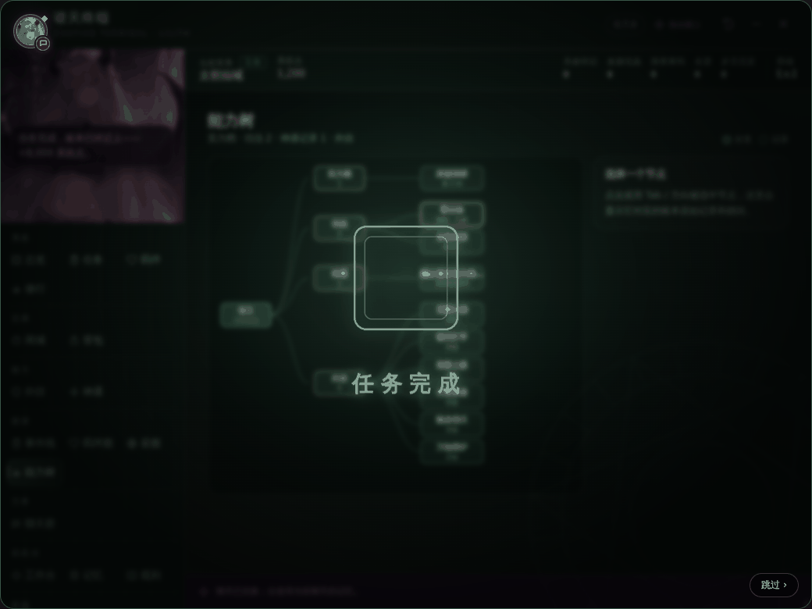

# 0.7.0 变更记录：世界主题 · 莉莉丝界面角色 · 图谱 · 演出

基线：本地 0.6.0。
目标：终端不再只是换成紫色的数据表。现在它会跟着当前世界换主题；莉莉丝会对你选中的东西和结算结果作出反应；任务、羁绊、到过的世界、能力都能以图谱方式查看；重要结果会播放一段短演出。**所有这些都只读账本，演出也只在账本写入并读回之后才播放。**

验收结果见 [ACCEPTANCE-0.7.0](ACCEPTANCE-0.7.0.md)。

## 一、世界主题

| 主题 | 触发（自动判断） | 外观 |
|---|---|---|
| 诸天（默认） | 判断不出来时 | 0.6.0 的配色，重新整理了层次 |
| 仙侠 | 类型：修仙、仙侠、玄幻、武侠、洪荒…；世界名：仙、宗、昆仑、太初…；货币：灵石、仙晶… | 玉简色板、星图、终端背景的淡阵纹 |
| 赛博 | 类型：赛博、科幻、星际、机甲、废土…；世界名：夜之城、2077、霓虹…；货币：信用点… | 全息终端：冷色、扫描线网格 |
| 诡异 | 类型：诡异、怪谈、克苏鲁、恐怖、灵异…；世界名：雾、血月、收容…；货币：冥币、理智… | 克制的异常感：暗红描边、边缘缓慢侵蚀的暗角；只有顶栏世界名每 11 秒错位一下（约 0.3 秒），不全屏闪烁 |

- 判断顺序：`世界类型` → `当前世界` 名称 → 当前世界货币。穿越到新世界时，旧的 `世界类型` 不会带到新世界（旧类型只在世界名没变时才采信）。
- 设置 → 世界与演出 →「界面主题」可以固定某个主题，或选「跟随当前世界」。
- 主题**只换颜色和装饰**，所有按钮、导航、输入框的位置在各主题下完全一样（验收里逐个比对了坐标）。装饰层 `pointer-events:none`，不会挡住点击。
- 原版状态栏引擎（终端里的 8 个分页）也跟着换色：只改它原本就有的 CSS 变量，不改布局。
- 装饰动效都很慢（阵纹 120 秒转一圈、扫描线 7 秒一趟）。系统偏好「减少动态效果」时全部静止。
- 顶栏「当前世界」旁显示主题徽标（玉简 / 全息 / 异常），点击打开星图。
- **新账本字段**：`诸天系统.世界类型`（字符串）和 `诸天系统.万界足迹`（数组，每项 `{名称, 类型, 主题, 首次, 首次楼层, 次数, 最近, 最近楼层}`）。当前世界变化时自动记一笔足迹，走 0.6.0 的加锁写入和读回。
- 「提示 AI 记录穿越」（默认开）：注入一条系统提示，让模型在穿越时于原版「变量更新」里写 `当前世界` 和 `世界类型`。**只用模拟模型验证过，真实模型是否遵守未验证。**

## 二、莉莉丝作为界面角色

只用原版立绘、原版分层动作（`rig`）和已有的 8 种表情差分，**没有新增动作，也没有伪装成 Live2D**。

- **反应**（设置可关）：
  - 在事件线 / 羁绊图 / 星图 / 能力树里选中一个节点，或在原版的任务、背包、修行分页里点一条记录时，莉莉丝换表情并说一句带账本数据的话，例如「拜入青云门」，进行中。进度 40%。
  - 任务完成、突破、契约、抽取、入库、任务失败：各有对应表情（失败是 sad）。
  - 进入系统页时说一句简短提示（每页每次会话一次，可关）。这类提示不占用反应的频率限制，所以不会挡住你紧接着的点击反应。
- **镜头**（设置可关）：
  - 系统页：半身；
  - 莉莉丝工作台：全身；
  - 私聊：左上角头像区换成面部特写条；
  - 剧情提示（终端关闭时的结果卡片）：胸像。
  - 全部用原图的像素坐标裁切，不缩放变形。

## 三、图谱（导航新增「图谱」组）

四个页面，**每个节点都对应一条真实账本记录**。点击或用 Tab / 方向键 + Enter 选中后，右侧显示这条记录的原始字段和账本路径（如 `诸天系统.任务库.T2`），以及能跳到哪里。

| 页面 | 数据来源 | 跳转 |
|---|---|---|
| 事件线 | `任务库`、`任务结算凭据`；任务的 `来源` / `依据` 连成起因 → 任务 → 结算凭据 / 失败 / 奖励 | 「在任务页定位」打开原版任务分页并选中原来那一行；「定位楼层」滚动到对应聊天楼层 |
| 羁绊图 | `恋爱目标`、`聊天群.成员`、`打手`，莉莉丝在中心 | 群员 → 聊天群群员页 |
| 星图 | `万界足迹`（按首次到访排列）、当前世界 | 「记录穿越」可以手动锁定一个新世界（写入并读回，会播放穿越演出） |
| 能力树 | `宿主实力档`、`功法库`、`神通记录`、外挂（原版 6 个 + 自拟外挂的启用状态） | 功法 → 修行分页；外挂 → 外挂管理 |

- 原版引擎的 总览 / 羁绊 / 任务 / 修行 分页右上角多了一个「查看星图 / 羁绊图 / 事件线 / 能力树」链接，可以双向跳转。
- 手机上图谱可以左右拖动，不会把文字缩到看不清。

## 四、演出

| 演出 | 触发（账本里读回到的变化） |
|---|---|
| 穿越 | `当前世界` 变了 |
| 突破 | `功法待播报` 新增一条，或 `宿主实力档` 升高 |
| 契约 | `恋爱目标` 锁定新对象，或聊天群新群员入群 |
| 任务完成 / 任务失败 | 新的 `任务结算凭据`，或任务状态变为 已完成 / 已失败 |
| 抽取 | `累计抽数` 增加（最高品级取自 神品次数 / 仙品次数） |
| 奖励入库 | 背包里有物品数量增加 |

- **只在账本保存并读回后播放**：比对的是保存前后两份读回的账本，不看模型文字。播放前再核对一次当前账本，已经被回滚（比如你删了楼层、切了分支）的，不播放，并在记录里标为「未入账」。
- 每段 1.4–2.1 秒，点击、Esc、Enter 都能跳过；跳过后焦点回到原来的位置。
- 结束后一定留下一张结果卡片：发生了什么、数额 / 物品，和「✓ 账本已确认」；卡片上的「查看记录」跳到对应的图谱节点或分页。
- 终端没打开时，不会弹全屏演出，而是在聊天旁边出现一张带莉莉丝胸像的剧情提示卡片；打开终端时自动收起。
- 设置 → 演出：完整演出 / 只显示结果卡片 / 关闭。系统「减少动态效果」时自动只显示卡片。关闭后仍会在「本次会话的演出」里留记录。
- 「预览演出」按钮可以看效果，不写账本，卡片会标明“预览”。
- 聊天群抢红包、领赠礼入账后（0.6.0 已预留的调用）也会显示同一张结果卡片。

## 五、布局与清理

- 终端样式整理成 CSS 变量，主题、布局、图谱、演出各自一个样式文件（`world.css` / `atlas.css` / `fx.css`），主题文件不碰布局规则。
- 顶栏、导航、卡片的层次和间距重新调整；手机顶栏的主题徽标不再压住「系统点」。
- **状态栏兼容模式的处理**：
  - 设置里不再提供「楼层内原版状态栏（旧兼容模式）」，以及只对它有效的「旧楼层精简显示」「状态栏最大深度」两项。
  - 已经在用旧兼容模式的存档，升级时**自动迁移一次**到终端模式（标记 `migrated070`，只迁一次）；如果之后仍被显式设成旧模式，设置里会显示“旧兼容模式”，但不再作为可选项。
  - 旧模式的代码保留（`native_replace040.py` 等回归套件仍用它），诊断面板按终端模式显示。
- 终端里跳到聊天楼层时，该楼层会短暂描边（`styles/host.css`）。

## 文件

新增：
- `src/world.js`：主题判断、万界足迹、穿越提示词。
- `src/lilith-stage.js`：莉莉丝反应、台词和镜头。
- `src/hub-atlas.js`：图谱四页。
- `src/fx.js`：账本差异检测、读回核对、演出和结果卡片。
- `styles/world.css`、`styles/atlas.css`、`styles/fx.css`。
- `tests/v070.test.js`（纯逻辑，15 项）、`tests/native_world070.py`（真实宿主浏览器）、`tests/qa/seed070.js`（截图用的隔离测试账本）。
- `docs/CHANGES-0.7.0.md`、`docs/ACCEPTANCE-0.7.0.md`、`docs/evidence/w070-*.png`。

修改：
- `index.js`：启动新模块。
- `src/hub.js`：「图谱」导航组、可叠加的钩子 `hook()`、主题装饰层、顶栏主题徽标、引擎主题配色。
- `src/settings.js`：`world` / `fx` / `lilith` 设置，旧兼容模式一次性迁移。
- `src/hub-settings.js`：「世界与演出」设置组、莉莉丝开关，去掉旧兼容模式选项。
- `src/features.js`：诊断按终端模式显示。
- `src/contracts.js`：版本号和能力矩阵。
- `styles/hub.css`：改为 CSS 变量；`styles/host.css`：楼层描边。
- `manifest.json`、`package.json`、`package-lock.json`：版本 0.7.0；`npm run check` 加入新文件。
- `tests/qa/run_matrix.sh`：加入 `native_world070.py`；没有 v1.1 原版文件时跳过 `native_replace040.py` 并注明。
- `README.md`、`docs/FEATURE_MATRIX.md`、`docs/INSTALL_ACCEPTANCE.md`、`docs/evidence/guards.json`、`FILELIST.sha256`。
